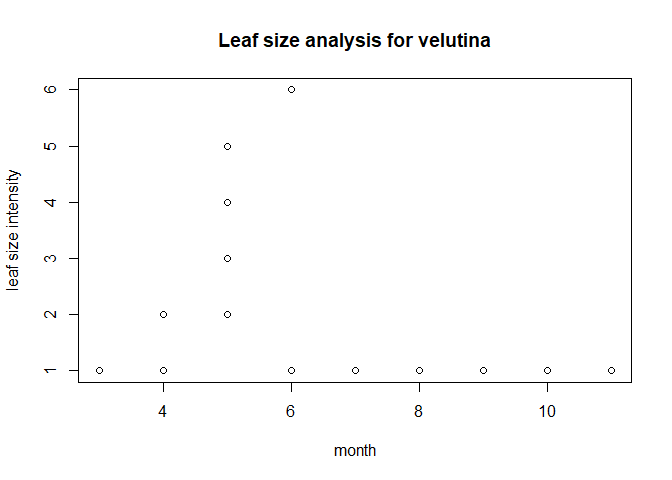

### 1. Executive Summary

-   In this document, team "Morton Arboretum" has analyzed the dataset and developed plots on the Oak Tree Phenology Data Set, for the year 2017. Going forwards, our team will work and provide more insights on the dataset by analyzing the trends.

### 2. Data cleaning on 2017 Dataset

-   Read the CSV File into a dataframe

    -   Set up the Working Directory

    -   Perfrom the Data Cleaning like last time

``` r
plotdata = read.csv("plotdata.csv", header = TRUE, stringsAsFactors = FALSE)
```

na.exclude(plotdata)

``` r
View(plotdata)
```

``` r
plotdata$leaf_breaking_bud_intensity[plotdata$leaf_breaking_bud_intensity == "10-Mar"] <- "03-10"
plotdata$flower_buds_intensity[plotdata$flower_buds_intensity == "10-Mar"] <- "03-10"
plotdata$fruit_intensity[plotdata$fruit_intensity == "10-Mar"] <- "03-10"
plotdata$fruit_drop_intensity[plotdata$fruit_drop_intensity == "10-Mar"] <- "03-10"
plotdata$flower_buds_intensity[plotdata$flower_buds_intensity == "43169.00"] <- "03-10"
plotdata[plotdata == ""] <- "0"
plotdata$leaf_increasing_size_intensity[plotdata$leaf_increasing_size_intensity == "0"] <- "1"
```

Run the below command to get insight onto the data

``` r
str(plotdata)
```

    ## 'data.frame':    2874 obs. of  29 variables:
    ##  $ X.1                           : int  1 2 3 4 5 6 7 8 9 10 ...
    ##  $ X                             : int  1 2 3 4 5 6 7 8 9 10 ...
    ##  $ date_observed                 : chr  "3/8/2017" "3/9/2017" "3/9/2017" "3/9/2017" ...
    ##  $ genus                         : chr  "Acer" "Quercus" "Quercus" "Quercus" ...
    ##  $ species                       : chr  "x freemanii" "acutissima" "acutissima" "bicolor" ...
    ##  $ id                            : chr  "321-56*3" "644-33*1" "644-33*1" "135-U*1" ...
    ##  $ leaf_breaking_bud_observed    : int  0 0 0 0 0 0 0 0 0 0 ...
    ##  $ leaf_breaking_bud_intensity   : chr  "0" "0" "0" "0" ...
    ##  $ leaf_observed                 : int  0 0 0 0 0 0 0 0 0 0 ...
    ##  $ leaf_intensity                : chr  "0" "0" "0" "0" ...
    ##  $ leaf_increasing_size_observed : int  0 0 0 0 0 0 0 0 0 0 ...
    ##  $ leaf_increasing_size_intensity: chr  "1" "1" "1" "1" ...
    ##  $ leaf_color_observed           : int  0 0 0 0 0 0 0 0 0 0 ...
    ##  $ leaf_color_intensity          : chr  "0" "0" "0" "0" ...
    ##  $ leaf_falling_observed         : int  0 0 0 0 0 0 0 0 0 0 ...
    ##  $ flower_buds_observed          : int  1 0 0 0 0 0 0 0 0 1 ...
    ##  $ flower_buds_intensity         : chr  "11-100" "0" "0" "0" ...
    ##  $ flower_open_observed          : int  1 0 0 0 0 0 0 0 0 1 ...
    ##  $ flower_open_intensity         : chr  "0" "0" "0" "0" ...
    ##  $ fruit_observed                : int  0 0 0 0 0 0 0 0 0 0 ...
    ##  $ fruit_intensity               : chr  "0" "0" "0" "0" ...
    ##  $ fruit_ripe_observed           : int  0 0 0 0 0 0 0 0 0 0 ...
    ##  $ fruit_ripe_intensity          : chr  "0" "0" "0" "0" ...
    ##  $ fruit_drop_observed           : int  0 0 0 0 0 0 0 0 0 0 ...
    ##  $ fruit_drop_intensity          : chr  "0" "0" "0" "0" ...
    ##  $ notes_observer                : chr  "0" "0" "0" "0" ...
    ##  $ notes_entry                   : chr  "0" "0" "0" "0" ...
    ##  $ month                         : int  3 3 3 3 3 3 3 3 3 3 ...
    ##  $ date                          : int  8 9 9 9 9 9 9 9 9 9 ...

Import the dplyr library

``` r
library(dplyr)
```

    ## 
    ## Attaching package: 'dplyr'

    ## The following objects are masked from 'package:stats':
    ## 
    ##     filter, lag

    ## The following objects are masked from 'package:base':
    ## 
    ##     intersect, setdiff, setequal, union

### 3. Perform the below steps

``` r
deletedata <- select(plotdata, -X.1, -X)
deletedata$leaf_increasing_size_intensity[deletedata$leaf_increasing_size_intensity == "0"] <- as.numeric("1")
deletedata$leaf_increasing_size_intensity[deletedata$leaf_increasing_size_intensity == "5-24%"] <- as.numeric("2")
deletedata$leaf_increasing_size_intensity[deletedata$leaf_increasing_size_intensity == "<25%"] <- as.numeric("2")
deletedata$leaf_increasing_size_intensity[deletedata$leaf_increasing_size_intensity == "25-49%"] <- "3"
deletedata$leaf_increasing_size_intensity[deletedata$leaf_increasing_size_intensity == "25-49"] <- "3"
deletedata$leaf_increasing_size_intensity[deletedata$leaf_increasing_size_intensity == "50-74%"] <- "4"
deletedata$leaf_increasing_size_intensity[deletedata$leaf_increasing_size_intensity == "50-74% "] <- "4"
deletedata$leaf_increasing_size_intensity[deletedata$leaf_increasing_size_intensity == "75-94%"] <- "5"
deletedata$leaf_increasing_size_intensity[deletedata$leaf_increasing_size_intensity == ">95%"] <- "6"
is.character(deletedata$leaf_increasing_size_intensity)
```

    ## [1] TRUE

    * list(deletedata$leaf_increasing_size_intensity)

### 4. Plots

-   We developed plots to identify the following

    -   Leaf Size for all species

#### Plot 1: Size of the leaves filtered by month for all species

``` r
#normalplot for leaf_increasing_size_intensity based on month
#plot(deletedata$leaf_increasing_size_intensity ~ deletedata$month)
plot(deletedata$leaf_increasing_size_intensity ~ deletedata$month,main="Leaf size analysis",xlab="month",ylab="leaf size intensity")
```


#### Plot 2: Size of the leaves filtered by month for species Palustris

``` r
#subsetting and plotting again based on month
palustris_subset <- subset(deletedata, species=="palustris")
#plot(palustris_subset$leaf_increasing_size_intensity ~ palustris_subset$month)
plot(palustris_subset$leaf_increasing_size_intensity ~ palustris_subset$month,main="Leaf size analysis for palustris",xlab="month",ylab="leaf size intensity")
```


#### Plot 3: Size of the leaves filtered by month for species Velutina

``` r
velutina_subset <- subset(deletedata, species=="velutina")
#plot(velutina_subset$leaf_increasing_size_intensity ~ velutina_subset$month)
plot(velutina_subset$leaf_increasing_size_intensity ~ velutina_subset$month,main="Leaf size analysis for velutina",xlab="month",ylab="leaf size intensity")
```



### 5. ggplot2

#### Using ggplot library to plot the same and the results answer our research question 2.

    * Step 1. Prepare the data

``` r
#using ggplot
palustris_subset = subset(deletedata, species=="palustris")
alba_subset = subset(deletedata, species=="alba")
rubra_subset_plot = subset(plotdata, species=="rubra")
```

    * Step 2. Import the library

``` r
library(ggplot2)
```

    * Step 3. Develop ggplots for Species "Palustris" and "Alba" filtered by month

``` r
fig = ggplot(palustris_subset, aes(palustris_subset$month, palustris_subset$leaf_increasing_size_intensity
)) + 
  geom_point()+ 
  scale_x_continuous(name = "month", breaks = c(2,3,4,5,6,7,8,9,10,11,12))+ 
  ylab("Leaf increase size")+
ggtitle("Leaf size analysis for species palustris") 

fig
```


``` r
fig0 = ggplot(alba_subset, aes(alba_subset$month, alba_subset$leaf_increasing_size_intensity
)) + 
  geom_point()+ 
  scale_x_continuous(name = "month", breaks = c(2,3,4,5,6,7,8,9,10,11,12))+ 
  ylab("Leaf increase size")+
  ggtitle("Leaf size analysis for species alba")   

fig0
```


### 6. grid extra

    {r grid extra}

    library(gridExtra)
    grid.arrange(fig,fig0,fig4,nrow=3)

#### Plots for leaf breaking observed, flower breaking observed and Fruit breaking observed versus Months in 2017 specifically for rubra species. This answers the research question number 8.

    * Plot

``` r
spline_int_rubra_leaf = as.data.frame(spline(rubra_subset_plot$month, rubra_subset_plot$leaf_breaking_bud_observed))
fig1 = ggplot(rubra_subset_plot, aes(rubra_subset_plot$month, rubra_subset_plot$leaf_breaking_bud_observed
)) + geom_line(data = spline_int_rubra_leaf, aes(x=x, y=y))+ scale_x_continuous(name = "month", breaks = c(2,3,4,5,6,7,8,9,10,11,12)) + scale_y_continuous(name = "Leaf budding time", limits = c(-0.01,1), breaks = c(0,1))+
  ggtitle("Leaf size analysis for species rubra")

fig1  
```


``` r
spline_int_rubra = as.data.frame(spline(rubra_subset_plot$month, rubra_subset_plot$flower_buds_observed))
fig2 = ggplot(rubra_subset_plot, aes(rubra_subset_plot$month, rubra_subset_plot$flower_buds_observed
)) + geom_line(data = spline_int_rubra, aes(x=x, y=y))+ scale_x_continuous(name = "month", breaks = c(2,3,4,5,6,7,8,9,10,11,12)) + scale_y_continuous(name = "Flower budding time", limits = c(-0.01,1), breaks = c(0,1))+
  ggtitle("Flower budding time analysis for species rubra")


fig2
```


``` r
spline_int_rubra_fruit = as.data.frame(spline(rubra_subset_plot$month, rubra_subset_plot$fruit_observed))
fig3 = ggplot(rubra_subset_plot, aes(rubra_subset_plot$month, rubra_subset_plot$fruit_observed
)) + geom_line(data = spline_int_rubra_fruit, aes(x=x, y=y))+ scale_x_continuous(name = "month", breaks = c(2,3,4,5,6,7,8,9,10,11,12)) + scale_y_continuous(name = "Fruit observed time", limits = c(-0.01,1.1), breaks = c(0,1))+
  ggtitle("Fruit time analysis for species rubra")


fig3
```


### 6. Conclusion

In the coming week, our team will work on adding the weather data and developing plots to provide insightful visualizations.

### 7. Contributorship Statement

-   Goutham - RMarkdown document, RHTML, Verify the Plots, Push to Git
-   Shashank and Sujana - Developed R Plots

-   **Proofread** : Everyone
