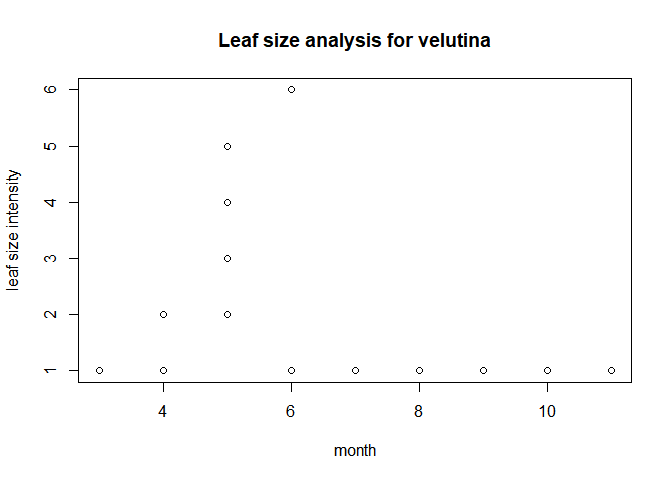

Datacleaning\_Rmarkdown
================
Shashank Patibandla
2018-12-06

-   [Final Document along with R Scripts, Visualizations and DataCleaning Documentation](#final-document-along-with-r-scripts-visualizations-and-datacleaning-documentation)
    -   [Data Cleaning & Documentation](#data-cleaning-documentation)
    -   [Morton Arboretum](#morton-arboretum)
        -   [Description of the data source](#description-of-the-data-source)
        -   [Any intellectual policy constraints, or lack thereof (licensing).](#any-intellectual-policy-constraints-or-lack-thereof-licensing.)
        -   [Description of the metadata](#description-of-the-metadata)
        -   [Issues with the data](#issues-with-the-data)
        -   [Description of your rationale for the steps you???re taking to remediate data.](#description-of-your-rationale-for-the-steps-youre-taking-to-remediate-data.)
        -   [Data cleaning process](#data-cleaning-process)
    -   [R Scripts Documentation](#r-scripts-documentation)
        -   [1. Executive Summary](#executive-summary)
        -   [2. Data cleaning on 2017 Dataset](#data-cleaning-on-2017-dataset)
        -   [3. Find the Range of Intensities based on Species](#find-the-range-of-intensities-based-on-species)
        -   [4. Descriptive statistics](#descriptive-statistics)
    -   [Visualization Documentation](#visualization-documentation)
        -   [1. Executive Summary](#executive-summary-1)
        -   [2. Data cleaning on 2017 Dataset](#data-cleaning-on-2017-dataset-1)
        -   [3. Perform the below steps](#perform-the-below-steps)
        -   [4. Plots](#plots)
        -   [5. ggplot2](#ggplot2)
        -   [6. grid extra](#grid-extra)
        -   [7. Grid Extra Overview](#grid-extra-overview)
        -   [A contributorship statement.](#a-contributorship-statement.)

Final Document along with R Scripts, Visualizations and DataCleaning Documentation
==================================================================================

In this document We have combined all the documentation, codes for Data Cleaning, R scripts and Visualizations, so that it is much more easier to go through and understand

Data Cleaning & Documentation
-----------------------------

Morton Arboretum
----------------

### Description of the data source

We received the data from one of the staff at the Morton Arboretum, Dr. Christine Rollinson. The data we received had three files:
- Metadata of the dataset
- Oak Trees data collection for the year 2017
- Oak Trees data collection for the year 2018

The dataset has information about the Oak tree Collection from around the world. The idea in here is to observe all the different trees on how do they respond to the climatic conditions at the Arboretum.

The dataset has 32 columns and around 3000 observations for each year. We are highlighting the important columns below: - Genus
- Species
- date\_observed
- id (uniquely identifies a tree)
- Data about leaves such as
- Leaf\_breaking\_bud\_observed - Leaf\_breaking\_bud\_intensity - Leaf\_size\_increased - Leaf\_color\_observed - Leaf\_color\_intensity - Leaf\_Falling\_Observed - Data about Flowers
- Data about Fruits (acorns)

With the data, we have, we will be able to do a research and identify how different species respond to the climatic conditions. Provided the data about the native behaviour of all those species, our team will be able to provide more insight into this topic but that is out of scope as of now.

### Any intellectual policy constraints, or lack thereof (licensing).

The dataset was provided by our client and we did not look for any external sources for data, because of which it will be covered by the Licensing terms and conditions of Morton Arboretum. We are using the data with the consent of the client which is Morton Arboretum.

For Licensing terms and conditions of Morton Arboretum [Click Here](http://www.mortonarb.org/visit-explore/about-arboretum/terms-and-conditions)
Adding to that, our team will update the licensing terms upon referring the data from any external source.

### Description of the metadata

The project was started in March 2017 and is an ongoing process. The metadata contains a spreadsheet that describes the other two excel sheet (data for 2017 and 2018) that was provided. The spreadsheet describes what each column is, description of what is included in each column and clarification of the units that were provided. The provided spreadsheet clearly summarized what this project/research is all about and their data collection method. The brief description that was provided for each column was helpful for us to understand what each column meant.

### Issues with the data

The 2018 data is not complete: data from 2017 is from March-Dec. But we only have data from March to August for 2018. The data we received is good overall, but there were some issues that we encountered. The issues we encountered in each year's data are as follows:

#### 2017

Leaf\_breaking\_bud\_observed: 10 missing value.
Leaf\_breaking\_bud\_intensity: few values were as 10-March instead of count estimate. And most of the values were missing
Leaf\_observed: 40 missing values
Leaf\_intensity: 686 blank
Leaf\_increasing\_size observed: 12 missing field
Leaf\_increasing\_size intensity: 1954 missing field
leaf\_color\_observed: 43 blanks and one - ? (does have a note for ?)
leaf\_color\_intensity: 233 blank.
leaf\_falling observed: 45 blank and 5 - ? (no notes)
leaf\_falling\_intensity: mentioned in metadata but cannot find this column
flower\_buds\_observed: 13 blanks and two - ? (note for only one)
flower\_buds\_intensity: 722 blank and 10 - 10-mar
flower\_open\_observed: 13 blank and one - ? (does have note for ???????)
flower\_open\_intensity: 741 blank
flower\_pollen\_release\_observed: 14 blank and 177 - ? and only 7 has notes
flower\_pollen\_release\_intensity: 157 blank and notes on only 22
fruit\_observed: 16 blank and 16 - ? and only 2 has notes
fruit\_intensity: 626 blank and 71 has 10-mar
fruit\_ripe \_observed: 21 blank and 6 - ? only three has notes
fruit\_ripe\_intensity: 611 blanks (only 173 has notes)
fruit\_drop\_observed: 17 blank and 6 ? only three has notes
fruit\_drop\_intensity: 568 blank and 71 has 10-Mar

#### 2018

In 2018 there are few new units in each column like there is did not look and NA but there is only Yes No blank and ? in the 2017 data and in the metadata. And there is also no notes in the 2018 data so there is no way to know the reason behind the missing data or why the did not look. There is NA instead of blank in the 2018 data.

Leaf\_breaking\_bud\_observed: 30 - did not look, and 21 - ?
Leaf\_breaking\_bud\_intensity: 2627 - NA and two 10-Mar
Leaf\_observed: 20 - did not look, 25 - ? and 28 - NA
Leaf\_intensity: 1684 - NA
Leaf\_increasing\_size observed: 30 - did not look, 42 - ? and 29 - NA
Leaf\_increasing\_size intensity: 2493 - NA
leaf\_color\_observed: 67 - did not look, 21 - ? and 29 - NA
leaf\_color\_intensity: 2819 - NA
leaf\_falling observed: 67 - did not look, 14 - ? and 29 - NA
leaf\_falling\_intensity: mentioned in metadata but cannot find this column
flower\_buds\_observed: 27 - did not look, 24 - ?and 29 - NA
flower\_buds\_intensity: 2642 - NA and 6 - 10-Mar
flower\_open\_observed: 60 - did not look, 38 - ? and 29 - NA
flower\_open\_intensity: 2725 - NA
flower\_pollen\_release\_observed: 74 - did not look, 48 - ? and 29 - NA
flower\_pollen\_release\_intensity: have totally different units : little, lots, NA, none ,some
fruit\_observed: 21 - did not look, 96 - ? and 29 - NA
fruit\_intensity: 3212 - NA
fruit\_ripe \_observed: 21 - did not look, 21 - ? and 29 - NA
fruit\_ripe\_intensity: 2847 - NA
fruit\_drop\_observed: 37 - did not look, 18 - ? and 29 - NA
fruit\_drop\_intensity: 2867 - NA

### Description of your rationale for the steps you???re taking to remediate data.

10-Mar was actually the range from 3-10, so we changed all 10-Mar to 3-10

There are ? in some places. If there is note we kept is as it is. We deleted the ones that do not have notes

In the columns observed, there is a binary question: Y or N. If there is Y then the value is assigned accordingly for the intensity column. If it is N then the value would be 0 in intensity column. We added 0 on intensity column if the observed column has N.

### Data cleaning process

#### Setting the working directory

<p>
we set the directory where we will be doing all the work and saving our files

``` r
knitr::opts_chunk$set(cache=TRUE)
knitr::opts_knit$set(root.dir = "C:/Users/shashank/Documents/USA/ISQA 8086 - Data to decisions/MortonArboretum/2017-2018_Rollinson") 
```

#### Load Data for Observations in 2017

<p>
you should have the original .csv file in the working directory.

``` r
arboretum_data <- read.csv("PhenologyObservations_2017_LC_Oaks.csv")
```

#### Removing Unnessary Columns

<p>
We will be removing all the unnecessary columns which are not required for the analysis

``` r
unwanted_columns_removed = subset(arboretum_data, select = -c(site, observer, date_entered, data_entry, data_entered_NPN, flower_pollen_release_observed, flower_pollen_release_intensity) )
```

#### Writing the semi-cleaned data into a csv file

<p>
we write this to a .csv file which will now have cleaned data in terms of the columns required

``` r
write.csv(unwanted_columns_removed,'arboretumcolumnscleaned.csv')
```

#### Cleaning unwanted rows

<p>
Now we switch to column cleaned data in Excel which is called "arboretumcolumnscleaned.csv" and will begin cleaning the unwanted rows based on some conditions using in Excel

<td>
Step 1. filter on "leaf\_color\_observed" field in the excel with "?" and find if their is any valid notes in the "notes\_observer" field.
</td>
<td>
Step 2. If the "notes\_observer" field is filled, then leave the row containing the "?" as-is.
</td>
<td>
Step 3. If the "notes\_observer" field is not filled, then remove the whole row which contains the "?"
</td>
<td>
Step 4. Repeat steps 1 to 3 for all the fields listed here - "leaf\_breaking\_bud\_observed", "leaf\_observed", "leaf\_increasing\_size\_observed", "leaf\_falling\_observed", "flower\_buds\_observed", "flower\_open\_observed", "fruit\_observed", "fruit\_ripe\_observed" and "fruit\_drop\_observed"
</td>
#### Saving the cleaned rows .csv file

<p>
Now we should have a .csv file which contains cleaned data with respect to rows and columns.

<p>
we will save this manually using the name "arboretumcolumnsandrowscleaned.csv" in the working directory

#### Replacing data with blank fields based on a condition

<p>
Now we switch to column and row cleaned data in Excel which is called "arboretumcolumnsandrowscleaned.csv" and will begin cleaning the blank values based on some conditions using in Excel

<td>
Step 1. filter on "leaf\_breaking\_bud\_observed" field in the excel with "N" and find if the corresponding intensity field(in this case it is the "leaf\_breaking\_bud\_intensity" field) has a "0" or a blank.
</td>
<td>
Step 2. If the corresponding intensity field is "0", then leave the it as-is.
</td>
<td>
Step 3. If the corresponding intensity field is blank, then fill the same field with a "0". so that troughout the sheet we have similar data, meaning a no is corresponding to a "0" intensity level
</td>
<td>
Step 4. Repeat steps 1 to 3 for all the fields listed here - "leaf\_color\_observed", "leaf\_observed", "leaf\_increasing\_size\_observed", "leaf\_falling\_observed", "flower\_buds\_observed", "flower\_open\_observed", "fruit\_observed", "fruit\_ripe\_observed" and "fruit\_drop\_observed"
</td>
<p>
For some of the intensity fields. The value is "10-Mar" instead of "10-03". For this we filter on such values and change them to "10-3". All such values are only found in "intensity" fields such as "leaf\_breaking\_bud\_intensity". Repeat this step for all the intesity fields

#### Saving the cleaned rows .csv file

<p>
Now we should have a .csv file which contains fully cleaned data with respect to rows and columns and values.

<p>
we will save this manually using the name "arboretumfullycleaned.csv" in the working directory

#### Load Data for Observations in 2018

<p>
you should have the original .csv file in the working directory.

``` r
arboretum_data_2018 <- read.csv("PhenologyObservations_2018_LC_Oaks.csv")
```

#### Removing Unnessary Fields

<p>
We will be removing all the unnecessary columns which are not required for the analysis

``` r
unwanted_columns_removed_2018 = subset(arboretum_data_2018, select = -c(Timestamp, Observer, Email.Address, Leaf.falling.observed, Flower.pollen.release.observed, Flower.pollen.release.intensity) )
```

#### Renaming fields for consistency in both 2017 and 2018 data

<p>
We will rename the columns so that both the 2017 and 2018 data have similiar column names

``` r
colnames(unwanted_columns_removed_2018)[colnames(unwanted_columns_removed_2018)=="PlantNumber"]<-"id"
colnames(unwanted_columns_removed_2018)[colnames(unwanted_columns_removed_2018)=="Notes"]<-"Notes.Observer"
```

#### Writing the semi-cleaned/column cleaned data into a csv file

<p>
we write this to a .csv file which will now have cleaned data in terms of the columns required

``` r
write.csv(unwanted_columns_removed_2018,'arboretumcolumnscleaned2018.csv')
```

#### Diferentiating the species from the Genus

<p>
Now we switch to column cleaned data in Excel which is called "arboretumcolumnscleaned2018.csv" and can differentiate the species from the genus. In the current sheet we have both the genus and species in the same field i.e "Species".

<td>
create a new field called "genus" just before the "species" field and we will seperate the genus from the species. This will help us have consistent columns in 2017 and 2018 data.

#### Saving the cleaned rows .csv file

<p>
Now we should have a .csv file which contains consistent data and columns with respect 2017 data.

<p>
we will save this manually using the name "arboretum2018consistent.csv" in the working directory

#### Cleaning unwanted rows

<p>
Now we switch to column cleaned data in Excel which is called "arboretum2018consistent.csv" and will begin cleaning the unwanted rows based on some conditions using in Excel

<td>
Step 1. filter on "leaf.color.observed" field in the excel with "?" or "did not look for" and find if their is any valid notes in the "notes.observer" field.
</td>
<td>
Step 2. If the "Notes.Observer" field is filled, then leave the row containing the "?" or "did not look for" as-is.
</td>
<td>
Step 3. If the "Notes.Observer" field is not filled, remove the whole row which contains the "?" or "did not look for"
</td>
<td>
Step 4. Repeat steps 1 to 3 for all the fields listed here - "leaf.breaking.bud.observed", "leaf.observed", "leaf.increasing.size.observed", "leaf.falling.observed", "flower.buds.observed", "flower.open.observed", "fruit.observed", "fruit.ripe.observed" and "fruit.drop.observed"
</td>
#### Saving the cleaned rows .csv file

<p>
Now we should have a .csv file which contains cleaned data with respect to rows and columns.

<p>
we will save this manually using the name "arboretumcolumnsandrowscleaned2018.csv" in the working directory

#### Replacing data with blank fields based on a condition

<p>
Now we switch to column cleaned data in Excel which is called "arboretumcolumnsandrowscleaned.csv" and will begin cleaning the unwanted rows based on some conditions using in Excel

<td>
Step 1. filter on "leaf.breaking.bud.observed" field in the excel with "N" and find if the corresponding intensity field(in this case it is the "leaf.breaking.bud.intensity" field has a "0" or a blank.
</td>
<td>
Step 2. If the corresponding intensity field is "0", then leave the it as-is.
</td>
<td>
Step 3. If the corresponding intensity field is blank, then fill the same field with a "0". so that troughout the sheet we have similar data, meaning a no is corresponding to a "0" intensity level
</td>
<td>
Step 4. Repeat steps 1 to 3 for all the fields listed here - "leaf.color.observed", "leaf.observed", "leaf.increasing.size.observed", "leaf.falling.observed", "flower.buds.observed", "flower.open.observed", "fruit.observed", "fruit.ripe.observed" and "fruit.drop.observed"
</td>
<p>
For some of the intensity fields. The value is "10-Mar" instead of "10-03". For this we filter on such values and change them to "10-3". All such values are only found in "intensity" fields such as "leaf\_breaking\_bud\_intensity". Repeat this step for all the intesity fields

#### Saving the cleaned file to .csv file

<p>
Now we should have a .csv file which contains cleaned data with respect to rows and columns.

<p>
we will save this manually using the name "arboretumfullycleaned2018.csv" in the working directory

#### To view any files created/written in R we use

View(filename)

R Scripts Documentation
-----------------------

### 1. Executive Summary

-   In this document, team "Morton Arboretum" has covered the descriptive analysis performed on the Oak Tree Phenology Data Set, for the year 2017. Going forwards, our team will work and provide more insights on the dataset by generating plots.

### 2. Data cleaning on 2017 Dataset

#### Step 1: Read the CSV File into a dataframe

-   Set up the Working Directory

-   Read the data from the CSV file into the Dataframe named "analysisdata"

-   Our dataset has records which has values as "NA". Exclude them from the analysis so as to focus on the ones which has accurate values

-   Go through the dataframe to understand the data

    na.exclude(analysisdata)

#### Step 2: To understand more about the data

-   We ran the below command to get an insight onto the data

<!-- -->

    ## 'data.frame':    2874 obs. of  26 variables:
    ##  $ X                             : int  1 2 3 4 5 6 7 8 9 10 ...
    ##  $ date_observed                 : chr  "3/8/2017" "3/9/2017" "3/9/2017" "3/9/2017" ...
    ##  $ genus                         : chr  "Acer" "Quercus" "Quercus" "Quercus" ...
    ##  $ species                       : chr  "x freemanii" "acutissima" "acutissima" "bicolor" ...
    ##  $ id                            : chr  "321-56*3" "644-33*1" "644-33*1" "135-U*1" ...
    ##  $ leaf_breaking_bud_observed    : int  0 0 0 0 0 0 0 0 0 0 ...
    ##  $ leaf_breaking_bud_intensity   : chr  "0" "0" "0" "0" ...
    ##  $ leaf_observed                 : int  0 0 0 0 0 0 0 0 0 0 ...
    ##  $ leaf_intensity                : chr  "0" "0" "0" "0" ...
    ##  $ leaf_increasing_size_observed : int  0 0 0 0 0 0 0 0 0 0 ...
    ##  $ leaf_increasing_size_intensity: chr  "0" "0" "0" "0" ...
    ##  $ leaf_color_observed           : int  0 0 0 0 0 0 0 0 0 0 ...
    ##  $ leaf_color_intensity          : chr  "0" "0" "0" "0" ...
    ##  $ leaf_falling_observed         : int  0 0 0 0 0 0 0 0 0 0 ...
    ##  $ flower_buds_observed          : int  1 0 0 0 0 0 0 0 0 1 ...
    ##  $ flower_buds_intensity         : chr  "11-100" "0" "0" "0" ...
    ##  $ flower_open_observed          : int  1 0 0 0 0 0 0 0 0 1 ...
    ##  $ flower_open_intensity         : chr  "" "0" "0" "0" ...
    ##  $ fruit_observed                : int  0 0 0 0 0 0 0 0 0 0 ...
    ##  $ fruit_intensity               : chr  "0" "0" "0" "0" ...
    ##  $ fruit_ripe_observed           : int  0 0 0 0 0 0 0 0 0 0 ...
    ##  $ fruit_ripe_intensity          : chr  "0" "0" "0" "0" ...
    ##  $ fruit_drop_observed           : int  0 0 0 0 0 0 0 0 0 0 ...
    ##  $ fruit_drop_intensity          : chr  "0" "0" "0" "0" ...
    ##  $ notes_observer                : chr  "" "" "" "" ...
    ##  $ notes_entry                   : chr  "" "" "" "" ...

#### Step 3: Perform Data Cleaning using the below steps

-   The data looked clean when we did step 2, but we wanted to take a close look at the dataset to understand if needs to be cleaned

-   Looking at the dataset, we figured out that we had a mix up with Date and percentage values. Date had replaced some of the columns which had percentages. In our cleaning exercise, we had replaced the required fields with percentage values using the below mentioned steps.

### 3. Find the Range of Intensities based on Species

-   After cleaning the data, we went ahead to find the range of intensities on specific columns based on Oak tree species by following the below mentioned steps.

-   Why Range?

    -   Our intention is to predict how the trees are responding over time to the climatic conditions.
    -   Right now, we do not have the **weather data** included in the dataset. Going forwards, our team will work on the weather data to provide **insightful visualizations**.

1.  Range between leaf\_breaking\_bud\_intensity against Species

    -   This helps us understand the estimate of how many leaf buds are breaking based on species.

<!-- -->

    ##          species leaf_breaking_bud_intensity.FUN1
    ## 1         lyrata                                0
    ## 2     acutissima                                0
    ## 3           alba                           >10000
    ## 4        bicolor                           >10000
    ## 5       coccinea                                0
    ## 6    dalechampii                           >10000
    ## 7  ellipsoidalis                           >10000
    ## 8       gambelii                                0
    ## 9      georgiana                                0
    ## 10  hartwissiana                           >10000
    ## 11    ilicifolia                           >10000
    ## 12    imbricaria                           >10000
    ## 13        lobata                                0
    ## 14        lyrata                           >10000
    ## 15    macrocarpa                           >10000
    ## 16   marilandica                           >10000
    ## 17     michauxii                           >10000
    ## 18       montana                           >10000
    ## 19 muehlenbergii                           >10000
    ## 20     palustris                           >10000
    ## 21       petraea                                0
    ## 22       phellos                                0
    ## 23     prinoides                           >10000
    ## 24     pyrenaica                                0
    ## 25         robur                              <5%
    ## 26         rubra                           >10000
    ## 27     shumardii                           >10000
    ## 28      stellata                           >10000
    ## 29    subfalcata                           >10000
    ## 30      velutina                           >10000
    ## 31   x freemanii                                0
    ##    leaf_breaking_bud_intensity.FUN2
    ## 1                                 0
    ## 2                                 0
    ## 3                            11-100
    ## 4                            11-100
    ## 5                            11-100
    ## 6                            11-100
    ## 7                            11-100
    ## 8                            11-100
    ## 9                          101-1000
    ## 10                           11-100
    ## 11                           11-100
    ## 12                           11-100
    ## 13                       1001-10000
    ## 14                                2
    ## 15                           11-100
    ## 16                           11-100
    ## 17                           11-100
    ## 18                           11-100
    ## 19                           11-100
    ## 20                       1001-10000
    ## 21                           11-100
    ## 22                         101-1000
    ## 23                           11-100
    ## 24                           11-100
    ## 25                           11-100
    ## 26                           11-100
    ## 27                           11-100
    ## 28                           11-100
    ## 29                       1001-10000
    ## 30                           11-100
    ## 31                                0

1.  Range between leaf\_intensity against Species

    -   This helps us understand the estimate of potential canopy space based on species, ignoring the dead branches.

<!-- -->

    ##          species leaf_intensity.FUN1 leaf_intensity.FUN2
    ## 1         lyrata                >95%                >95%
    ## 2     acutissima                   0                   0
    ## 3           alba                 <5%              75-94%
    ## 4        bicolor                >95%              75-94%
    ## 5       coccinea                <95%              75-94%
    ## 6    dalechampii                >95%              75-94%
    ## 7  ellipsoidalis                >95%              75-94%
    ## 8       gambelii                 <5%              75-94%
    ## 9      georgiana                >95%                   0
    ## 10  hartwissiana                >95%              75-94%
    ## 11    ilicifolia                >95%              75-94%
    ## 12    imbricaria                >95%              75-94%
    ## 13        lobata                >95%              25-49%
    ## 14        lyrata                >95%              75-94%
    ## 15    macrocarpa                 <5%              75-94%
    ## 16   marilandica                >95%              75-94%
    ## 17     michauxii                >95%              75-94%
    ## 18       montana                <95%              75-94%
    ## 19 muehlenbergii                >95%              75-94%
    ## 20     palustris                >95%              50-74%
    ## 21       petraea                >95%              75-94%
    ## 22       phellos                >95%               5-24%
    ## 23     prinoides                 <5%              75-94%
    ## 24     pyrenaica                >95%              75-94%
    ## 25         robur                >95%              75-94%
    ## 26         rubra                 <5%              75-94%
    ## 27     shumardii                >95%              75-94%
    ## 28      stellata                >95%              75-94%
    ## 29    subfalcata                >95%              50-74%
    ## 30      velutina                 <5%              75-94%
    ## 31   x freemanii                   0                   0

1.  Range between leaf\_increasing\_size\_intensity against Species

    -   This helps us understand the estimate of the number of leaves that are fully grown

<!-- -->

    ##          species leaf_increasing_size_intensity.FUN1
    ## 1         lyrata                                >95%
    ## 2     acutissima                                   0
    ## 3           alba                                <25%
    ## 4        bicolor                                >95%
    ## 5       coccinea                                   0
    ## 6    dalechampii                                >95%
    ## 7  ellipsoidalis                                <25%
    ## 8       gambelii                                >95%
    ## 9      georgiana                                   0
    ## 10  hartwissiana                                <25%
    ## 11    ilicifolia                                <25%
    ## 12    imbricaria                                >95%
    ## 13        lobata                                   0
    ## 14        lyrata                                <25%
    ## 15    macrocarpa                                <25%
    ## 16   marilandica                                <25%
    ## 17     michauxii                                >95%
    ## 18       montana                                <25%
    ## 19 muehlenbergii                                <25%
    ## 20     palustris                                   0
    ## 21       petraea                                <25%
    ## 22       phellos                                <25%
    ## 23     prinoides                                <25%
    ## 24     pyrenaica                                   0
    ## 25         robur                                <25%
    ## 26         rubra                                <25%
    ## 27     shumardii                                   0
    ## 28      stellata                                >95%
    ## 29    subfalcata                                >95%
    ## 30      velutina                                <25%
    ## 31   x freemanii                                   0
    ##    leaf_increasing_size_intensity.FUN2
    ## 1                                 >95%
    ## 2                                    0
    ## 3                               75-94%
    ## 4                               75-94%
    ## 5                                5-24%
    ## 6                               75-94%
    ## 7                               75-94%
    ## 8                               75-94%
    ## 9                               75-94%
    ## 10                              75-94%
    ## 11                              75-94%
    ## 12                              50-74%
    ## 13                              50-74%
    ## 14                              75-94%
    ## 15                              75-94%
    ## 16                              75-94%
    ## 17                              75-94%
    ## 18                              75-94%
    ## 19                              50-74%
    ## 20                              50-74%
    ## 21                              75-94%
    ## 22                              25-49%
    ## 23                              75-94%
    ## 24                              75-94%
    ## 25                              75-94%
    ## 26                              75-94%
    ## 27                              75-94%
    ## 28                              75-94%
    ## 29                              75-94%
    ## 30                              75-94%
    ## 31                                   0

1.  Range between leaf\_color\_intensity against Species

    -   This helps us understand the estimate of the potential canopy space is full with non-green leaf color, ignoring dead branches.

<!-- -->

    ##          species leaf_color_intensity.FUN1 leaf_color_intensity.FUN2
    ## 1         lyrata                         0                         0
    ## 2     acutissima                         0                         0
    ## 3           alba                       <5%                    75-94%
    ## 4        bicolor                      >95%                    75-94%
    ## 5       coccinea                       <5%                    75-94%
    ## 6    dalechampii                       <5%                    75-94%
    ## 7  ellipsoidalis                       <5%                    75-94%
    ## 8       gambelii                       <5%                    75-94%
    ## 9      georgiana                      >95%                    50-74%
    ## 10  hartwissiana                       <5%                     5-24%
    ## 11    ilicifolia                       <5%                    75-94%
    ## 12    imbricaria                       <5%                    50-74%
    ## 13        lobata                      >95%                    75-94%
    ## 14        lyrata                       <5%                    75-94%
    ## 15    macrocarpa                       <5%                    75-94%
    ## 16   marilandica                       <5%                    75-94%
    ## 17     michauxii                       <5%                    50-74%
    ## 18       montana                      >95%                    75-94%
    ## 19 muehlenbergii                       <5%                    75-94%
    ## 20     palustris                       <5%                    75-94%
    ## 21       petraea                       <5%                    75-94%
    ## 22       phellos                      >95%                     5-24%
    ## 23     prinoides                       <5%                    75-94%
    ## 24     pyrenaica                      >95%                    50-74%
    ## 25         robur                       <5%                    75-94%
    ## 26         rubra                       <5%                    75-94%
    ## 27     shumardii                      >95%                    75-94%
    ## 28      stellata                       <5%                    75-94%
    ## 29    subfalcata                      >95%                     5-24%
    ## 30      velutina                       <5%                    75-94%
    ## 31   x freemanii                         0                         0

1.  Range between flower\_buds\_intensity against Species

    -   This helps us understand the estimate of the number of flower buds that are present on each species

<!-- -->

    ##          species flower_buds_intensity.FUN1 flower_buds_intensity.FUN2
    ## 1         lyrata                          0                          0
    ## 2     acutissima                          0                          0
    ## 3           alba                     >10000                   101-1000
    ## 4        bicolor                     >10000                     11-100
    ## 5       coccinea                          0                     11-100
    ## 6    dalechampii                          0                   101-1000
    ## 7  ellipsoidalis                     >10000                     11-100
    ## 8       gambelii                          0                     11-100
    ## 9      georgiana                     >10000                     11-100
    ## 10  hartwissiana                     >10000                   101-1000
    ## 11    ilicifolia                     >10000                   101-1000
    ## 12    imbricaria                     >10000                     11-100
    ## 13        lobata                          0                          0
    ## 14        lyrata                          0                     11-100
    ## 15    macrocarpa                     >10000                     11-100
    ## 16   marilandica                     >10000                     11-100
    ## 17     michauxii                     >10000                     11-100
    ## 18       montana                     >10000                   101-1000
    ## 19 muehlenbergii                     >10000                 1001-10000
    ## 20     palustris                     >10000                     11-100
    ## 21       petraea                          0                     11-100
    ## 22       phellos                          0                          0
    ## 23     prinoides                     >10000                   101-1000
    ## 24     pyrenaica                          0                          0
    ## 25         robur                          0                      03-10
    ## 26         rubra                     >10000                   101-1000
    ## 27     shumardii                     >10000                     11-100
    ## 28      stellata                     >10000                     11-100
    ## 29    subfalcata                     >10000                 1001-10000
    ## 30      velutina                     >10000                  101-10000
    ## 31   x freemanii                          0                     11-100

1.  Range between flower\_open\_intensity against Species

    -   This helps us understand the estimate of the number of flower that are visible on each species

<!-- -->

    ##          species flower_open_intensity.FUN1 flower_open_intensity.FUN2
    ## 1         lyrata                          0                          0
    ## 2     acutissima                          0                          0
    ## 3           alba                       >95%                     75-94%
    ## 4        bicolor                       >95%                     25-49%
    ## 5       coccinea                       >95%                     50-74%
    ## 6    dalechampii                       >95%                     75-94%
    ## 7  ellipsoidalis                       >95%                     75-94%
    ## 8       gambelii                       >95%                     25-49%
    ## 9      georgiana                       >95%                          0
    ## 10  hartwissiana                       >95%                      5-24%
    ## 11    ilicifolia                       >95%                     75-94%
    ## 12    imbricaria                        <5%                      5-24%
    ## 13        lobata                          0                          0
    ## 14        lyrata                       >95%                          0
    ## 15    macrocarpa                       >95%                     75-94%
    ## 16   marilandica                        <5%                     75-94%
    ## 17     michauxii                       >95%                          0
    ## 18       montana                       >95%                     75-94%
    ## 19 muehlenbergii                        <5%                     25-49%
    ## 20     palustris                       >95%                     75-94%
    ## 21       petraea                       >95%                     75-94%
    ## 22       phellos                          0                          0
    ## 23     prinoides                        <5%                     75-94%
    ## 24     pyrenaica                          0                          0
    ## 25         robur                          0                          0
    ## 26         rubra                       >95%                     75-94%
    ## 27     shumardii                       >95%                          0
    ## 28      stellata                        <5%                     25-49%
    ## 29    subfalcata                       >95%                     25-49%
    ## 30      velutina                       >95%                     75-94%
    ## 31   x freemanii                          0                          0

1.  Range between fruit\_intensity against Species

    -   This helps us understand the estimate of the number of fruit that are present on each species

<!-- -->

    ##          species fruit_intensity.FUN1 fruit_intensity.FUN2
    ## 1         lyrata                    0                    0
    ## 2     acutissima                    0                    0
    ## 3           alba                   <3               11-100
    ## 4        bicolor               >10000               11-100
    ## 5       coccinea               >10000                    0
    ## 6    dalechampii               >10000               11-100
    ## 7  ellipsoidalis                    0               11-100
    ## 8       gambelii                   <3               11-100
    ## 9      georgiana               >10000             101-1000
    ## 10  hartwissiana                    0               11-100
    ## 11    ilicifolia               >10000               11-100
    ## 12    imbricaria               >10000             101-1000
    ## 13        lobata                    0                    0
    ## 14        lyrata                   <3               11-100
    ## 15    macrocarpa                   <3               11-100
    ## 16   marilandica                   <3               11-100
    ## 17     michauxii               >10000             101-1000
    ## 18       montana               >10000               11-100
    ## 19 muehlenbergii                    0             101-1000
    ## 20     palustris               >10000             101-1000
    ## 21       petraea                    0               11-100
    ## 22       phellos                    0                    0
    ## 23     prinoides                   <3               11-100
    ## 24     pyrenaica                    0                    0
    ## 25         robur                    0               11-100
    ## 26         rubra                   <3               11-100
    ## 27     shumardii               >10000               11-100
    ## 28      stellata                    0               11-100
    ## 29    subfalcata                    0             101-1000
    ## 30      velutina                   <3               11-100
    ## 31   x freemanii                    0                    0

1.  Range between fruit\_ripe\_intensity against Species

    -   This helps us understand the estimate of the number of fruit that are present on each species which are ripe

<!-- -->

    ##          species fruit_ripe_intensity.FUN1 fruit_ripe_intensity.FUN2
    ## 1         lyrata                         0                         0
    ## 2     acutissima                         0                         0
    ## 3           alba                      >95%                    75-94%
    ## 4        bicolor                      >95%                    75-94%
    ## 5       coccinea                         0                         0
    ## 6    dalechampii                         0                         0
    ## 7  ellipsoidalis                         0                         0
    ## 8       gambelii                         0                     5-24%
    ## 9      georgiana                      >95%                    75-94%
    ## 10  hartwissiana                         0                     5-24%
    ## 11    ilicifolia                      >95%                     5-24%
    ## 12    imbricaria                      >95%                    75-94%
    ## 13        lobata                         0                         0
    ## 14        lyrata                      >95%                    75-94%
    ## 15    macrocarpa                      >95%                         0
    ## 16   marilandica                      >95%                    75-94%
    ## 17     michauxii                         0                         0
    ## 18       montana                         0                    75-94%
    ## 19 muehlenbergii                       <5%                    75-94%
    ## 20     palustris                      >95%                    75-94%
    ## 21       petraea                         0                         0
    ## 22       phellos                         0                         0
    ## 23     prinoides                      >95%                    75-94%
    ## 24     pyrenaica                         0                         0
    ## 25         robur                         0                         0
    ## 26         rubra                      >95%                    75-94%
    ## 27     shumardii                         0                    75-94%
    ## 28      stellata                       <5%                     5-24%
    ## 29    subfalcata                      >95%                    75-94%
    ## 30      velutina                      >95%                    50-74%
    ## 31   x freemanii                         0                         0

1.  Range between fruit\_drop\_intensity against Species

    -   This helps us understand the estimate of the number of fruit that have dropped seeds since last time on each species

<!-- -->

    ##          species fruit_drop_intensity.FUN1 fruit_drop_intensity.FUN2
    ## 1         lyrata                         0                         0
    ## 2     acutissima                         0                         0
    ## 3           alba                    >10000                    11-100
    ## 4        bicolor                         0                1001-10000
    ## 5       coccinea                         0                         0
    ## 6    dalechampii                        <3                     03-10
    ## 7  ellipsoidalis                        <3                     03-10
    ## 8       gambelii                         0                     03-10
    ## 9      georgiana                         0                    11-100
    ## 10  hartwissiana                         0                    11-100
    ## 11    ilicifolia                         0                    11-100
    ## 12    imbricaria                         0                    11-100
    ## 13        lobata                         0                         0
    ## 14        lyrata                        <3                     03-10
    ## 15    macrocarpa                         0                     03-10
    ## 16   marilandica                         0                    11-100
    ## 17     michauxii                         0                         0
    ## 18       montana                         0                  101-1000
    ## 19 muehlenbergii                         0                    11-100
    ## 20     palustris                    >10000                  101-1000
    ## 21       petraea                         0                         0
    ## 22       phellos                         0                         0
    ## 23     prinoides                         0                    11-100
    ## 24     pyrenaica                         0                         0
    ## 25         robur                         0                     03-10
    ## 26         rubra                         0                    11-100
    ## 27     shumardii                         0                    11-100
    ## 28      stellata                         0                    11-100
    ## 29    subfalcata                         0                    11-100
    ## 30      velutina                         0                    11-100
    ## 31   x freemanii                         0                         0

### 4. Descriptive statistics

#### Understand which species shows what kind of phenophase

-   Our agenda in here is to understand how each species respond throughout the entire year. With the results whcih we obtain with the below commands helps us to understand whether is there a significant change that happens throughout the year for a particular species.

-   Adding weather data to the results will help us anlayze based on the seasonsal outcomes.

-   We will be adding the weather data sooner.

    View(rubra\_subset)

<!-- -->

    ##  leaf_breaking_bud_observed leaf_observed    leaf_increasing_size_observed
    ##  Min.   :0.0000             Min.   :0.0000   Min.   :0.0000               
    ##  1st Qu.:0.0000             1st Qu.:1.0000   1st Qu.:0.0000               
    ##  Median :0.0000             Median :1.0000   Median :0.0000               
    ##  Mean   :0.1466             Mean   :0.8087   Mean   :0.1652               
    ##  3rd Qu.:0.0000             3rd Qu.:1.0000   3rd Qu.:0.0000               
    ##  Max.   :1.0000             Max.   :1.0000   Max.   :1.0000               
    ##                             NA's   :1        NA's   :1                    
    ##  leaf_color_observed leaf_falling_observed flower_buds_observed
    ##  Min.   :0.0000      Min.   :0.0000        Min.   :0.0         
    ##  1st Qu.:0.0000      1st Qu.:0.0000        1st Qu.:0.0         
    ##  Median :0.0000      Median :0.0000        Median :0.0         
    ##  Mean   :0.4087      Mean   :0.3391        Mean   :0.2         
    ##  3rd Qu.:1.0000      3rd Qu.:1.0000        3rd Qu.:0.0         
    ##  Max.   :1.0000      Max.   :1.0000        Max.   :1.0         
    ##  NA's   :1           NA's   :1             NA's   :1           
    ##  flower_open_observed fruit_observed   fruit_ripe_observed
    ##  Min.   :0.0000       Min.   :0.0000   Min.   :0.00       
    ##  1st Qu.:0.0000       1st Qu.:0.0000   1st Qu.:0.00       
    ##  Median :0.0000       Median :1.0000   Median :0.00       
    ##  Mean   :0.1897       Mean   :0.5862   Mean   :0.25       
    ##  3rd Qu.:0.0000       3rd Qu.:1.0000   3rd Qu.:0.25       
    ##  Max.   :1.0000       Max.   :1.0000   Max.   :1.00       
    ##                                                           
    ##  fruit_drop_observed
    ##  Min.   :0.0000     
    ##  1st Qu.:0.0000     
    ##  Median :0.0000     
    ##  Mean   :0.3621     
    ##  3rd Qu.:1.0000     
    ##  Max.   :1.0000     
    ## 

-   We had performed the same operation for all the species but aren't mentioning it here.

Visualization Documentation
---------------------------

### 1. Executive Summary

-   In this document, team "Morton Arboretum" has analyzed the dataset and developed plots on the Oak Tree Phenology Data Set, for the year 2017. Going forwards, our team will work and provide more insights on the dataset by analyzing the trends.

### 2. Data cleaning on 2017 Dataset

-   Read the CSV File into a dataframe

    -   Set up the Working Directory

    -   Perfrom the Data Cleaning like last time

Run the below command to get insight onto the data

    ## 'data.frame':    2874 obs. of  29 variables:
    ##  $ X.1                           : int  1 2 3 4 5 6 7 8 9 10 ...
    ##  $ X                             : int  1 2 3 4 5 6 7 8 9 10 ...
    ##  $ date_observed                 : chr  "3/8/2017" "3/9/2017" "3/9/2017" "3/9/2017" ...
    ##  $ genus                         : chr  "Acer" "Quercus" "Quercus" "Quercus" ...
    ##  $ species                       : chr  "x freemanii" "acutissima" "acutissima" "bicolor" ...
    ##  $ id                            : chr  "321-56*3" "644-33*1" "644-33*1" "135-U*1" ...
    ##  $ leaf_breaking_bud_observed    : int  0 0 0 0 0 0 0 0 0 0 ...
    ##  $ leaf_breaking_bud_intensity   : chr  "0" "0" "0" "0" ...
    ##  $ leaf_observed                 : int  0 0 0 0 0 0 0 0 0 0 ...
    ##  $ leaf_intensity                : chr  "0" "0" "0" "0" ...
    ##  $ leaf_increasing_size_observed : int  0 0 0 0 0 0 0 0 0 0 ...
    ##  $ leaf_increasing_size_intensity: chr  "1" "1" "1" "1" ...
    ##  $ leaf_color_observed           : int  0 0 0 0 0 0 0 0 0 0 ...
    ##  $ leaf_color_intensity          : chr  "0" "0" "0" "0" ...
    ##  $ leaf_falling_observed         : int  0 0 0 0 0 0 0 0 0 0 ...
    ##  $ flower_buds_observed          : int  1 0 0 0 0 0 0 0 0 1 ...
    ##  $ flower_buds_intensity         : chr  "11-100" "0" "0" "0" ...
    ##  $ flower_open_observed          : int  1 0 0 0 0 0 0 0 0 1 ...
    ##  $ flower_open_intensity         : chr  "0" "0" "0" "0" ...
    ##  $ fruit_observed                : int  0 0 0 0 0 0 0 0 0 0 ...
    ##  $ fruit_intensity               : chr  "0" "0" "0" "0" ...
    ##  $ fruit_ripe_observed           : int  0 0 0 0 0 0 0 0 0 0 ...
    ##  $ fruit_ripe_intensity          : chr  "0" "0" "0" "0" ...
    ##  $ fruit_drop_observed           : int  0 0 0 0 0 0 0 0 0 0 ...
    ##  $ fruit_drop_intensity          : chr  "0" "0" "0" "0" ...
    ##  $ notes_observer                : chr  "0" "0" "0" "0" ...
    ##  $ notes_entry                   : chr  "0" "0" "0" "0" ...
    ##  $ month                         : int  3 3 3 3 3 3 3 3 3 3 ...
    ##  $ date                          : int  8 9 9 9 9 9 9 9 9 9 ...

Import the dplyr library

### 3. Perform the below steps

    ## [1] TRUE

### 4. Plots

-   We developed plots to identify the following

    -   Leaf Size for all species

#### Plot 1: Size of the leaves filtered by month for all species

    * Our main agenda in here is to understand how each Oak Tree species respond to the climatic conditions over time. To do that, we wanted to break down all the species based  on the following.
      
        * Leaves
        * Flower
        * Fruit

    * We will have to observe how leaves, flower and fruits of all the species respond to the climate. For this assignment and in this plot, we are going to observe how the leaves of all species respond to the climate over a period of an year.        


    * We identified that the leaves of all the species has seen its maximum size between the months 5 and 7.  

#### Plot 2: Size of the leaves filtered by month for species Palustris

    * Here, we are picking out a specific species to understand how its leaves respond to the climate 


#### Plot 3: Size of the leaves filtered by month for species Velutina



### 5. ggplot2

#### Using ggplot library to plot the same and the results answer our research question 2.

-   Research Question: Find out when Leaf size is maximum or minimum for different species throughout the year and what other data corelates with it.

    -   Step 1. Prepare the data

    -   Step 2. Import the library

    -   Step 3. Develop ggplots for Species "Palustris" and "Alba" filtered by month 

### 6. grid extra


#### Plots for leaf breaking observed, flower breaking observed and Fruit breaking observed versus Months in 2017 specifically for rubra species. This answers the research question number 8 which is "Does the time of budding impact the leafing and flowering time?".

    * Plot


### 7. Grid Extra Overview

#### This will give an overview all the budding related phenophases during an year for a specific specie.


### A contributorship statement.

1.  Sujana - Worked on the Visualizations and R scripts
2.  Goutam - Worked on the Visualizations and Rmarkdowns
3.  Shashank - Worked on data cleaning process and R scripts

Proofread by - Shashank Patibandla on 12/06/2018
